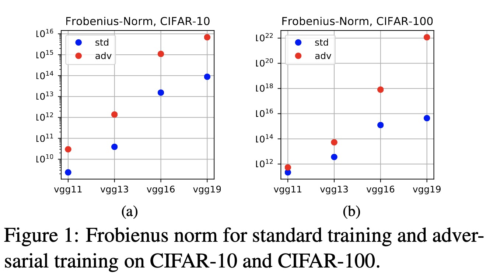

# Adversarial Rademacher Complexity of Deep Neural Network

This repository is the official PyTorch implementation of paper: Adversarial Rademacher Complexity of Deep Neural Network.

**Jiancong Xiao, Yanbo Fan, Ruoyu Sun, Zhi-Quan Luo**

**arXiv:** [https://arxiv.org/abs/2211.14966](https://arxiv.org/abs/2211.14966) 

## Abstract

Deep neural networks (DNNs) are vulnerable to adversarial attacks. Ideally, a robust model shall perform well on both the perturbed training data and the unseen perturbed test data. It is found empirically that fitting perturbed training data is not hard, but generalizing to perturbed test data is quite difficult. Therefore, it is of great interest to study the generalization guarantee from a learning theory perspective and this paper focuses on adversarial Rademacher complexity (ARC), which is concurrently introduced by (yin et al., 2018,khim et al., 2018). Their work mainly focused on linear functions and both pointed out that how to bound ARC of neural networks is largely unclear. Since then, there have been several attempts and the latest result only applied ARC to two-layer neural networks. The main challenge comes from analyzing the adversarial loss. In this paper, we resolve the problem and provide the first bound of adversarial Rademacher complexity of deep neural networks. Our bound is qualitatively comparable to the Rademacher complexity bounds in similar settings. The key ingredient is a bound on the changes in the output of max functions with respect to the change of their weights and inputs, thereby bounding ARC. Finally, we provide experiments to study the poor robust generalization. Our experiments show that the weight norm is an important factor related to the robust generalization gap.


## Main Result
Our main result states an upper bound of adversarial Rademacher complexity.
\paragraph{Main Result.} for depth-l, width-h fully-connected neural networks, assume that the weight matrices $W_1,W_2,\cdots,W_l$ in each of the $l$ layers have Frobenius norms bounded by $M_1,\cdots,M_l$, and all $n$ samples are bounded by $B$. Then, with high probability, 

$$\text{ARC}
\leq\mathcal{O}\bigg(\frac{(B+\epsilon)h\sqrt{l\log l}\prod_{j=1}^l M_j} {\sqrt{n}}\bigg).$$


## Experiments


we show the experiments of standard and adversarial training VGG on CIFAR-10 and CIFAR-100. The y-axis is in logarithmic scale. The weight norms of adv-trained models are larger than that of std-trained models, i.e., $W_{adv}\geq W_{std}$. Ablation studies are provided in Appendix C. $W_{adv}\geq W_{std}$ can also be observed in these experiments. 
## Citation
```
@article{xiao2022adversarial,
  title={Adversarial rademacher complexity of deep neural networks},
  author={Xiao, Jiancong and Fan, Yanbo and Sun, Ruoyu and Luo, Zhi-Quan},
  journal={arXiv preprint arXiv:2211.14966},
  year={2022}
}
```
